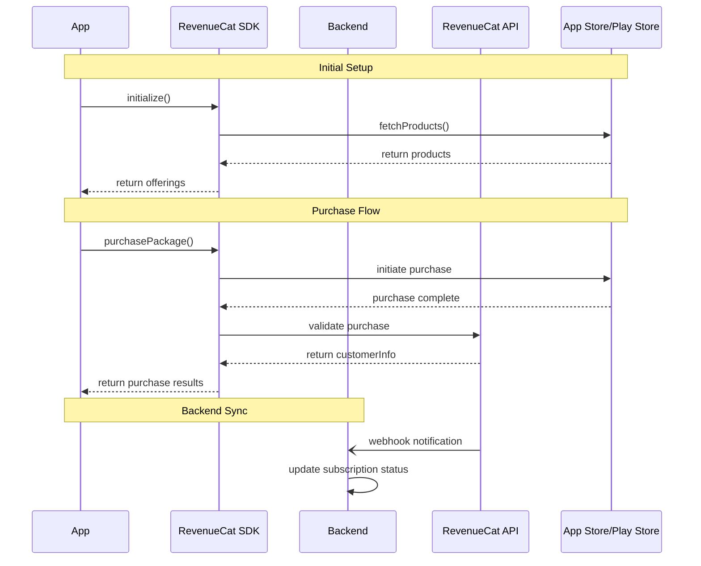

# React Native Payment Integration Using RevenueCat's SDK

## Purpose

Define mobile payment integration using RevenueCat's `react-native-purchases` SDK to implement In-App Purchases (IAP) for both iOS and Android platforms.

## Technology Stack

- React Native with Expo (Mobile)
- NextJS (Backend)
- tRPC
- Drizzle ORM
- RevenueCat `react-native-purchases`

## Technical Architecture



### Backend Implementation (NextJS)

#### Database using Drizzle ORM

```typescript
export const platformEnum = mysqlEnum("platform", ["IOS", "ANDROID"]);
export const purchaseTypeEnum = mysqlEnum("type", ["ONE_TIME", "SUBSCRIPTION"]);
export const purchaseStatusEnum = mysqlEnum("status", [
  "PENDING",
  "COMPLETED",
  "FAILED",
]);
export const subscriptionStatusEnum = mysqlEnum("status", [
  "ACTIVE",
  "CANCELLED",
  "PAST_DUE",
  "EXPIRED",
]);
export const logLevelEnum = mysqlEnum("level", ["info", "error", "warn"]);

export const purchases = mysqlTable("purchases", {
  id: varchar("id", { length: 128 }).primaryKey(),
  userId: varchar("user_id", { length: 128 }).notNull(),
  purchaseToken: varchar("purchase_token", { length: 256 }).unique().notNull(),
  productId: varchar("product_id", { length: 128 }).notNull(),
  platform: platformEnum.notNull(),
  type: purchaseTypeEnum.notNull(),
  status: purchaseStatusEnum.notNull(),
  metadata: json("metadata"),
  createdAt: timestamp("created_at").defaultNow().notNull(),
  updatedAt: timestamp("updated_at").onUpdateNow().notNull(),
});

export const subscriptions = mysqlTable("subscriptions", {
  id: varchar("id", { length: 128 }).primaryKey(),
  userId: varchar("user_id", { length: 128 }).unique().notNull(),
  platform: platformEnum.notNull(),
  status: subscriptionStatusEnum.notNull(),
  originalPurchaseId: varchar("original_purchase_id", { length: 256 })
    .unique()
    .notNull(),
  currentPeriodEnd: timestamp("current_period_end").notNull(),
  metadata: json("metadata"),
  createdAt: timestamp("created_at").defaultNow().notNull(),
  updatedAt: timestamp("updated_at").onUpdateNow().notNull(),
});
```

#### RevenueCat Webhook Handler (NextJS)

```typescript
// pages/api/webhooks/revenuecat.ts
export default async function handler(
  req: NextApiRequest,
  res: NextApiResponse
) {
  if (req.method !== "POST") {
    return res.status(405).end();
  }

  const event = req.body;
  const signature = req.headers["x-webhook-signature"];

  if (!verifyWebhookSignature(event, signature)) {
    return res.status(400).json({ error: "Invalid signature" });
  }

  try {
    switch (event.type) {
      case "INITIAL_PURCHASE":
      case "RENEWAL":
        await db
          .insert(subscriptions)
          .values({
            id: crypto.randomUUID(),
            userId: event.app_user_id,
            originalPurchaseId: event.original_purchase_id,
            status: "ACTIVE",
            platform: event.platform.toLowerCase(),
            currentPeriodEnd: new Date(event.expiration_date),
          })
          .onDuplicateKeyUpdate({
            set: {
              status: "ACTIVE",
              currentPeriodEnd: new Date(event.expiration_date),
            },
          });
        break;

      case "CANCELLATION":
        await db
          .update(subscriptions)
          .set({ status: "CANCELLED" })
          .where(
            eq(subscriptions.originalPurchaseId, event.original_purchase_id)
          );
        break;

      case "BILLING_ISSUE":
        await db
          .update(subscriptions)
          .set({ status: "PAST_DUE" })
          .where(
            eq(subscriptions.originalPurchaseId, event.original_purchase_id)
          );
        break;
    }

    res.status(200).json({ received: true });
  } catch (error) {
    console.error("Webhook error:", error);
    res.status(500).json({ error: "Webhook processing failed" });
  }
}

// utils/revenueCat.ts
export function verifyWebhookSignature(
  payload: string,
  signature: string,
  secret: string
): boolean {
  const hmac = crypto.createHmac("sha256", secret);
  const digest = hmac.update(payload).digest("hex");
  return crypto.timingSafeEqual(Buffer.from(signature), Buffer.from(digest));
}
```

#### tRPC API Implementation (NextJS)

```typescript
// server/routers/payments.ts
export const paymentsRouter = router({
  validatePurchase: publicProcedure
    .input(
      z.object({
        purchaseToken: z.string(),
        productId: z.string(),
        userId: z.string(),
      })
    )
    .mutation(async ({ input, ctx }) => {
      let purchaseId: string;

      try {
        // Create with PENDING status
        const [purchaseResult] = await db
          .insert(purchases)
          .values({
            id: purchaseId,
            userId: input.userId,
            purchaseToken: input.purchaseToken,
            productId: input.productId,
            status: "PENDING",
            platform: ctx.platform,
          })
          .returning();

        purchaseId = purchaseResult.id;

        const isValid = await verifyWithRevenueCat(input.purchaseToken);

        if (!isValid) {
          await db
            .update(purchases)
            .set({ status: "FAILED" })
            .where(eq(purchases.id, input.originalPurchaseId));
          throw new TRPCError({
            code: "BAD_REQUEST",
            message: "Invalid purchase token",
          });
        }

        const [completedPurchase] = await db
          .update(purchases)
          .set({ status: "COMPLETED" })
          .where(eq(purchases.id, input.originalPurchaseId))
          .returning();

        return completedPurchase;
      } catch (error) {
        // Update status to FAILED if we have a purchaseId
        if (purchaseId) {
          await db
            .update(purchases)
            .set({ status: "FAILED" })
            .where(eq(purchases.id, input.originalPurchaseId));
        }

        throw new TRPCError({
          code: "INTERNAL_SERVER_ERROR",
          message: "Purchase validation failed",
        });
      }
    }),
  getSubscriptionStatus: publicProcedure
    .input(
      z.object({
        userId: z.string(),
      })
    )
    .query(async ({ input }) => {
      const [subscriptionResult] = await db
        .select()
        .from(subscriptions)
        .where(eq(subscriptions.userId, input.userId))
        .returning();

      return subscriptionResult;
    }),
});
```

### Mobile Implementation (React Native)

#### RevenueCat SDK Configuration

```typescript
// config/revenueCat.ts
export const REVENUE_CAT_CONFIG = {
  apiKey: process.env.REVENUE_CAT_API_KEY,
  products: {
    oneTime: "casperai.ai-journal.onetime",
    subscription: "casperai.ai-journal.subscription.monthly",
  },
};

// services/purchases.ts
import Purchases from "react-native-purchases";

export class PurchaseService {
  static async initialize() {
    try {
      await Purchases.configure({
        apiKey: REVENUE_CAT_CONFIG.apiKey,
      });

      if (__DEV__) {
        Purchases.setLogLevel(Purchases.LOG_LEVEL.DEBUG);
      }
    } catch (error) {
      console.error("RevenueCat initialization failed:", error);
      throw error;
    }
  }

  static async getProducts() {
    try {
      const offerings = await Purchases.getOfferings();
      return offerings.current?.availablePackages ?? [];
    } catch (error) {
      throw new PaymentError(
        "PRODUCTS_FETCH_FAILED",
        "Failed to fetch products",
        error
      );
    }
  }

  static async purchaseProduct(packageId: string) {
    try {
      const { customerInfo, productIdentifier } =
        await Purchases.purchasePackage(packageId);
      return { customerInfo, productIdentifier };
    } catch (error) {
      if (!error.userCancelled) {
        throw new PaymentError("PURCHASE_FAILED", "Purchase failed", error);
      }
      throw error;
    }
  }

  static async restorePurchases() {
    try {
      const customerInfo = await Purchases.restorePurchases();
      return customerInfo;
    } catch (error) {
      throw new PaymentError(
        "RESTORE_FAILED",
        "Failed to restore purchases",
        error
      );
    }
  }

  static async checkSubscriptionStatus() {
    try {
      const customerInfo = await Purchases.getCustomerInfo();
      return {
        hasActiveSubscription: customerInfo.activeSubscriptions.length > 0,
        subscriptions: customerInfo.activeSubscriptions,
      };
    } catch (error) {
      throw new PaymentError(
        "STATUS_CHECK_FAILED",
        "Failed to check subscription status",
        error
      );
    }
  }
}
```

#### Error Handling (React Native)

```typescript
// utils/errorHandling.ts
export class PaymentError extends Error {
  constructor(
    public code: string,
    public message: string,
    public originalError?: any
  ) {
    super(message);
    this.name = "PaymentError";
  }
}

export const handlePaymentError = (error: any) => {
  if (error instanceof Purchases.PurchasesError) {
    switch (error.code) {
      case Purchases.PURCHASE_CANCELLED_ERROR:
        return new PaymentError("CANCELLED", "Purchase was cancelled by user");
      case Purchases.PRODUCT_NOT_AVAILABLE_ERROR:
        return new PaymentError(
          "PRODUCT_UNAVAILABLE",
          "Product is not available"
        );
      case Purchases.RECEIPT_FAILED_ERROR:
        return new PaymentError("RECEIPT_INVALID", "Receipt validation failed");
      default:
        return new PaymentError("UNKNOWN", "Unknown error occurred", error);
    }
  }
  return new PaymentError("SYSTEM_ERROR", "System error occurred", error);
};
```

#### Logging

```typescript
export const paymentLogs = mysqlTable("payment_logs", {
  id: varchar("id", { length: 128 }).primaryKey(),
  timestamp: timestamp("timestamp").defaultNow().notNull(),
  level: logLevelEnum.notNull(),
  event: varchar("event", { length: 128 }).notNull(),
  userId: varchar("user_id", { length: 128 }).notNull(),
  metadata: json("metadata"),
  error: json("error"),
});
```

```typescript
// utils/logger.ts
type LogLevel = "info" | "error" | "warn";

interface PaymentLog {
  level: LogLevel;
  event: string;
  userId: string;
  metadata?: Record<string, any>;
  error?: Error;
}

export class PaymentLogger {
  static async log({ level, event, userId, metadata, error }: PaymentLog) {
    const timestamp = new Date().toISOString();
    const logData = {
      timestamp,
      level,
      event,
      userId,
      metadata,
      error: error
        ? {
            message: error.message,
            stack: error.stack,
            name: error.name,
          }
        : undefined,
    };

    // Also save to database for querying
    await db.insert(paymentLogs).values(logData);
  }
}
```

And we can use it like this:

```typescript
await PaymentLogger.log({
  level: "info",
  event: "PURCHASE_INITIATED",
  userId: input.userId,
  metadata: { productId: input.productId },
});

await PaymentLogger.log({
  level: "info",
  event: "PURCHASE_CREATED",
  userId: input.userId,
  metadata: { purchaseId, status: "PENDING" },
});

await PaymentLogger.log({
  level: "error",
  event: "PURCHASE_VALIDATION_FAILED",
  userId: input.userId,
  metadata: { purchaseId },
});

await PaymentLogger.log({
  level: "info",
  event: "PURCHASE_COMPLETED",
  userId: input.userId,
  metadata: { purchaseId },
});

await PaymentLogger.log({
  level: "error",
  event: "PURCHASE_ERROR",
  userId: input.userId,
  metadata: { purchaseId },
  error: error as Error,
});

await PaymentLogger.log({
  level: "info",
  event: "WEBHOOK_RECEIVED",
  userId: event.app_user_id,
  metadata: {
    eventType: event.type,
    originalPurchaseId: event.original_purchase_id,
  },
});

await PaymentLogger.log({
  level: "error",
  event: "WEBHOOK_ERROR",
  userId: req.body?.app_user_id || "unknown",
  error: error as Error,
});
```

_Note: I only included this part as we need to log everything with regards to payment to make it easier for us to investigate when something went wrong. Maybe we can use monitoring platforms like Datadog._

## Testing Guide

### RevenueCat Dashboard Setup

1. Create app in RevenueCat dashboard
2. Configure products in App Store Connect/Play Console
3. Add webhook URL in RevenueCat dashboard
4. Add products to RevenueCat
5. Get API keys

### iOS Testing Setup

1. Create Sandbox Testers in App Store Connect
2. Test Device Setup:
   ```
   1. Sign out of production Apple ID
   2. Sign in with Sandbox Tester account
   3. Install app
   4. Test purchases (no real charges)
   ```

### Android Testing Setup

1. Test Track Setup:

   ```
   1. Create Internal Testing track in Play Console
   2. Add test users (emails)
   3. Upload app bundle
   ```

2. Test Cards:
   ```
   Visa: 4111111111111111
   Mastercard: 5555555555554444
   ```

### Testing Utilities (React Native)

```typescript
// utils/testPayments.ts
export const TestingUtilities = {
  async resetPurchases() {
    if (__DEV__) {
      await Purchases.reset();
    }
  },

  async getPurchaseInfo() {
    return await Purchases.getCustomerInfo();
  },

  async validateReceipt() {
    return await Purchases.syncPurchases();
  },
};
```